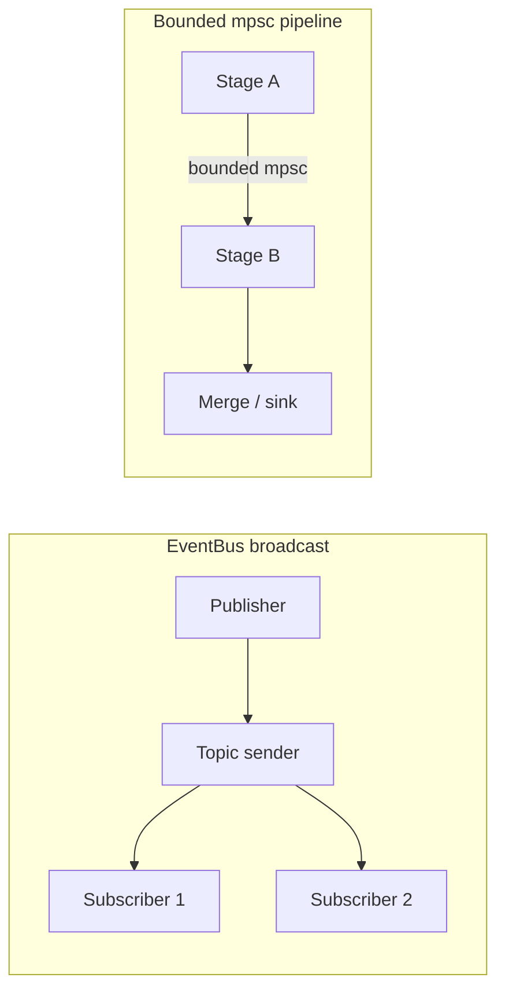

# pub-sub-pipeline

Async **pub/sub** (multi-topic fan-out via Tokio `broadcast`) plus **bounded `mpsc` pipeline** stages (map, broadcast fan-out, merge-in). Cooperative shutdown via `tokio_util::sync::CancellationToken` and `select!`.

Includes the **`pubsub` CLI** (ASCII banner, Clap help, optional `tracing` via `--verbose`) and **end-to-end CLI tests**.

## Architecture



| Mechanism | Role |
|-----------|------|
| **`broadcast`** | Fan-out: each subscriber receives a **clone** of `M`; slow readers can lag or drop if the buffer fills. |
| **Bounded `mpsc`** | **Backpressure** when a downstream stage is slow. |
| **`JoinSet`** | Fan-in: multiple async consumers with structured join handling. |
| **`CancellationToken` + `select!`** | Cooperative shutdown alongside channel receive. |

## Requirements

- **Rust 1.85+** (edition 2024; see `rust-version` in `Cargo.toml`).
- **Coverage** (optional): `cargo install cargo-llvm-cov --locked`
- **Nextest** (optional): `cargo install cargo-nextest --locked`

## Quick start

```bash
cargo test
cargo run --bin pubsub -- --help
cargo run --bin pubsub -- demo
printf "3\n4\n" | cargo run --bin pubsub -- squares
cargo run --example demo
```

### `pubsub` commands

| Command | Purpose |
|---------|---------|
| `demo` | Scripted run: broadcast → parse/square pipeline → merge |
| `squares` | Integers from stdin (one per line) → squares on stdout |
| `fanout` | In-process bus drill: `--topic`, `--subscribers`, `--count` |
| `--verbose` | Enable `tracing-subscriber` (`RUST_LOG`; defaults to `info` if unset) |

## Testing

| Workflow | Command |
|----------|---------|
| Default | `cargo test` |
| Nextest | `cargo nextest run` — see [`nextest.toml`](nextest.toml) and [nexte.st](https://nexte.st/) |
| Filter (built-in) | `cargo test <substring>` |

CLI integration tests use **`assert_cmd`** (`tests/cli_e2e.rs`).

## Coverage (≥ 80% lines)

1. `cargo install cargo-llvm-cov --locked`
2. With rustup: `rustup component add llvm-tools-preview`
3. Otherwise set `LLVM_COV` and `LLVM_PROFDATA` for your LLVM install (e.g. Homebrew on Apple Silicon):

   ```bash
   export LLVM_COV=/opt/homebrew/opt/llvm/bin/llvm-cov
   export LLVM_PROFDATA=/opt/homebrew/opt/llvm/bin/llvm-profdata
   ```

4. `cargo cov` — alias in [`.cargo/config.toml`](.cargo/config.toml) for `llvm-cov test --all-targets --fail-under-lines 80`.

## Verify locally

```bash
cargo fmt --check
cargo test
cargo nextest run   # optional
cargo cov           # optional
cargo --locked clippy --all-targets -- -D warnings
```

## Crate layout

| Piece | Role |
|--------|------|
| `EventBus<M>` | Per-topic pub/sub; lazy topics; non-zero broadcast capacity |
| `spawn_map_stage` / `spawn_*_cancellable` | Pipeline stages |
| `channel_pair` | Bounded `mpsc` pair |
| `scenarios` | Shared flows for CLI, example, and tests |
| `pubsub` | Binary: `src/main.rs` |

**Tests:** `tests/integration.rs`, `tests/cli_e2e.rs`, `tests/coverage_hotspots.rs`, `tests/scenarios.rs`.

## License

MIT — see `Cargo.toml`.
